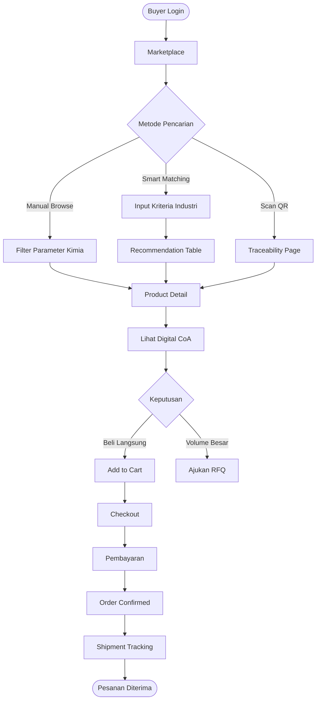
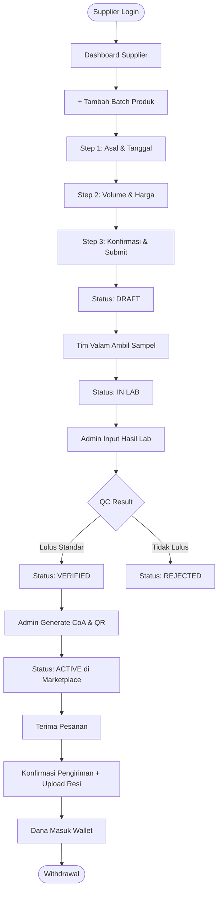
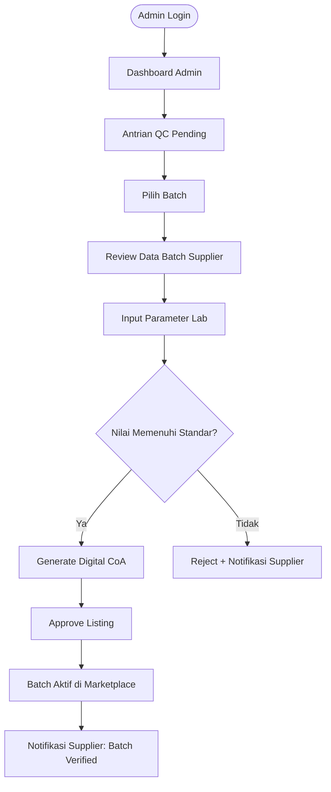
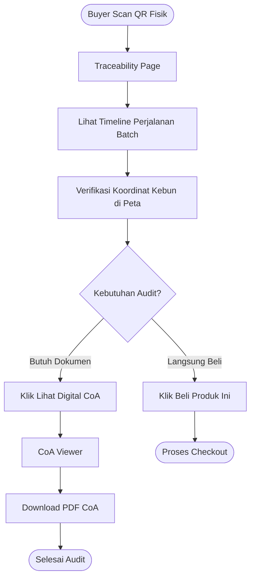

# Valam — Design Document

> **Platform B2B Managed-Marketplace Minyak Nilam**
> Versi: 1.0 | Fase: MVP | Dokumen ini berfungsi sebagai acuan desain UI/UX untuk tim designer, frontend developer, dan stakeholder.

---

## Daftar Isi

1. [Design Overview](#1-design-overview)
2. [Design Principles](#2-design-principles)
3. [User Experience Strategy](#3-user-experience-strategy)
4. [Information Architecture (IA)](#4-information-architecture-ia)
5. [Design System](#5-design-system)
6. [UI Component Library](#6-ui-component-library)
7. [Page Design Specification](#7-page-design-specification)
8. [User Flow Diagram](#8-user-flow-diagram)
9. [Responsive Design](#9-responsive-design)
10. [Accessibility](#10-accessibility)
11. [UX Writing](#11-ux-writing)
12. [Future Design Consideration](#12-future-design-consideration)

---

## 1. Design Overview

### Tujuan Desain

Valam bukan sekadar marketplace biasa. Desain platform ini dirancang sebagai **trust infrastructure** — sebuah sistem visual dan interaksi yang menjamin kepercayaan antara koperasi penyuling hulu (Supplier) dan pelaku industri hilir (Buyer). Setiap keputusan desain berangkat dari satu pertanyaan inti: *"Apakah tampilan ini membuat Buyer yakin bahwa minyak ini asli dan terverifikasi?"*

### Masalah Pengguna yang Diselesaikan

| Pengguna | Masalah | Solusi Desain |
|---|---|---|
| Supplier (Pak Darmawan) | Tidak bisa membuktikan kualitas minyaknya kepada pembeli | Dashboard status QC yang transparan dan QR siap cetak |
| Buyer Lokal (Larasati) | Tertipu minyak oplosan tanpa bisa verifikasi | Product card dengan data kimia prominan dan CoA digital |
| Buyer Global (Jean-Luc) | Tidak ada rekam jejak asal-usul produk untuk audit EUDR | Halaman traceability publik berbasis QR + peta koordinat |
| Admin | Pengelolaan validasi dan QC tersebar dan tidak terstruktur | Konsol admin terintegrasi satu layar |

### Hubungan Desain dengan Visi Produk

Visi Valam adalah menjadi **platform B2B e-commerce standar global** untuk komoditas minyak atsiri Indonesia. Desain menterjemahkan visi ini ke dalam tiga pilar visual:

1. **Transparansi** → Data laboratorium tampil di halaman utama, bukan tersembunyi di lampiran
2. **Keadilan** → Supplier mendapatkan visibilitas status yang sama seperti halnya buyer melihat produk
3. **Kepercayaan** → Setiap produk dilengkapi tanda verifikasi resmi yang tidak dapat dipalsukan secara visual

---

## 2. Design Principles

### 2.1 Transparency First

Kepercayaan dibangun melalui data yang terlihat, bukan klaim teks.

- Certificate of Analysis (CoA) ditampilkan sebagai komponen interaktif, bukan sekadar file PDF tersembunyi
- Nilai PA%, Moisture, dan parameter kimia lain ditampilkan dengan visualisasi grafik, bukan angka mentah
- Status verifikasi batch (Draft → In Lab → Verified) selalu terlihat tanpa harus masuk ke halaman detail
- Setiap produk memiliki **Verified Badge** yang hanya muncul setelah admin mengesahkan hasil lab

### 2.2 Data Over Decoration

Valam adalah platform procurement industri, bukan toko lifestyle. Hierarki informasi diprioritaskan:

**Tingkat 1 (Paling Menonjol):** PA%, Status Verified, Batch ID
**Tingkat 2:** Harga/kg, Volume tersedia, Asal daerah
**Tingkat 3:** Foto produk, nama koperasi, deskripsi

Elemen dekoratif diminimalkan. Background netral, ilustrasi hanya digunakan untuk empty state.

### 2.3 Simple For Supplier

Persona Supplier (Pak Darmawan, 48 tahun, literasi digital dasar) menentukan bahwa:

- Form input dibagi ke dalam langkah-langkah berurutan dengan progress indicator yang jelas
- Istilah teknis kimia tidak ditampilkan kepada Supplier — Admin yang menginput data lab
- Supplier hanya mengisi: Volume, Asal Lahan, Tanggal Produksi
- Feedback langsung (toast notification, status badge berubah warna) menggantikan pesan error panjang
- Tombol aksi utama selalu berukuran besar dan berada di posisi bawah layar (thumb-friendly)

### 2.4 Professional B2B Experience

Platform harus terasa seperti software procurement korporasi, bukan marketplace konsumen:

- Layout dense dengan informasi tabel, bukan grid foto besar
- Terminologi bisnis digunakan konsisten: "Batch", "RFQ", "CoA", "Lead Time"
- Warna dan tipografi mengikuti standar enterprise (kontras tinggi, font sans-serif yang dapat dibaca kecil)
- Fitur seperti Smart Matching dan RFQ mencerminkan workflow pengadaan profesional

---

## 3. User Experience Strategy

### 3.1 Supplier Experience

**Flow Utama:**
```
Login → Dashboard Supplier → Tambah Batch Produk → Menunggu Quality Check
     → Produk Diverifikasi → Produk Aktif di Marketplace → Terima Pesanan
     → Konfirmasi Pengiriman → Dana Masuk Wallet
```

**Halaman yang Dibutuhkan:**

| Halaman | Informasi Utama | Komponen Kunci |
|---|---|---|
| Dashboard Supplier | Ringkasan stok aktif, pesanan baru, saldo wallet, status batch terbaru | KPI cards, status badge, activity feed |
| Tambah Batch | Form input volume, asal lahan, tanggal produksi | Step wizard (3 langkah), upload foto, tombol simpan |
| Status Quality Check | Live tracker status batch (Draft → In Lab → Verified) | Timeline stepper, estimasi waktu, notifikasi |
| Inventory List | Semua batch, status, volume tersisa | Tabel dengan filter status, bulk action |
| Detail Pesanan | Informasi buyer, volume pesan, instruksi pengiriman | Order card, shipment tracker, tombol konfirmasi |
| Wallet | Saldo, riwayat transaksi, form withdrawal | Balance card, transaction list, withdrawal form |

**Prinsip UX Supplier:**
- Setiap perubahan status batch mengirimkan notifikasi in-app dan (opsional) SMS
- Halaman Wallet menampilkan indikator jelas kapan dana cair (misalnya: "Dana cair setelah resi valid")
- QR Code tersedia dalam format PDF siap cetak dengan panduan ukuran minimum

### 3.2 Buyer Experience

**Flow Utama:**
```
Login → Browse Marketplace → Filter Parameter Kimia → Lihat Product Detail
     → Validasi Digital CoA → Scan QR Traceability → Checkout / Ajukan RFQ
```

**Halaman yang Dibutuhkan:**

| Halaman | Informasi Utama | Komponen Kunci |
|---|---|---|
| Marketplace | Grid produk dengan PA%, harga/kg, asal daerah | Filter sidebar, product cards, sort options |
| Smart Matching | Form kriteria kebutuhan → daftar rekomendasi berurutan | Input form, result cards dengan match score |
| Product Detail | Semua parameter kimia, info koperasi, ketersediaan volume | Chemical parameter chart, batch info, CTA buttons |
| Digital CoA | Sertifikat analisis lengkap dengan tanda tangan digital admin | CoA viewer component, parameter table, download button |
| QR Traceability | Timeline perjalanan minyak + peta koordinat kebun | Timeline component, Google Maps embed |
| Cart & Checkout | Kalkulasi volume, ongkir kargo, total biaya | Order summary, shipping calculator, payment gateway |
| Order History | Daftar pesanan, status pengiriman, invoice | Order list, shipment tracker, download invoice |

**Bagaimana Buyer Menemukan Produk:**
1. **Browse Manual** — Filter marketplace berdasarkan PA% minimum, harga, dan asal daerah
2. **Smart Matching** — Input kriteria industri (volume, budget, spesifikasi kimia) → sistem merekomendasikan 5 batch terbaik dengan skor kecocokan
3. **Scan QR** — Buyer memindai QR pada sampel fisik → langsung ke halaman traceability produk

**Bagaimana Kepercayaan Dibangun:**
- Verified Badge hanya tampil setelah CoA ditandatangani admin
- CoA tidak bisa diunduh tanpa login (mencegah pemalsuan beredar)
- Traceability menampilkan koordinat GPS kebun sumber — dapat diverifikasi mandiri oleh buyer global

### 3.3 Admin Experience

**Flow Utama:**
```
Dashboard Admin → Validasi Akun Supplier → Terima Sampel Fisik → Input Hasil Lab
               → Generate CoA Digital → Approve Listing → Monitor Transaksi
```

**Halaman yang Dibutuhkan:**

| Halaman | Tugas Utama | Komponen Kunci |
|---|---|---|
| Dashboard Admin | Overview platform: pending validasi, batch in-review, transaksi hari ini | KPI cards, alert list, activity log |
| Validasi Supplier | Review dokumen legalitas koperasi → approve/reject | Document viewer, checklist, approval button |
| QC Management | Input angka hasil lab untuk batch terdaftar | Form input parameter (PA%, Moisture, dll), submit & generate CoA |
| Product Approval | Review batch setelah QC → aktifkan di marketplace | Batch detail, QC result summary, approve/reject |
| Monitoring Transaksi | Daftar semua order, status pembayaran, dispute | Transaction table, filter, export CSV |

---

## 4. Information Architecture (IA)

```
Valam
│
├── Landing Page
│   ├── Hero Section (Value Proposition)
│   ├── Cara Kerja Platform
│   ├── Statistik Platform (supplier, buyer, transaksi)
│   └── CTA: Daftar sebagai Supplier / Buyer
│
├── Authentication
│   ├── Login
│   ├── Register (Pemilihan Role: Supplier / Buyer)
│   └── Forgot Password
│
├── Buyer Dashboard
│   ├── Marketplace
│   │   ├── Filter (PA%, harga, asal daerah, volume)
│   │   ├── Sort (relevansi, harga, rating)
│   │   └── Product Grid
│   ├── Smart Matching
│   │   ├── Input Form Kriteria
│   │   └── Hasil Rekomendasi (dengan Match Score)
│   ├── Product Detail
│   │   ├── Chemical Parameter Section
│   │   ├── Batch Info
│   │   ├── Supplier Info
│   │   └── CTA: Add to Cart / Ajukan RFQ
│   ├── Digital CoA
│   │   ├── CoA Viewer
│   │   └── Download PDF
│   ├── QR Traceability
│   │   ├── Timeline Perjalanan Batch
│   │   └── Peta Koordinat Kebun
│   ├── Cart & Checkout
│   ├── RFQ Submission
│   └── Order History & Tracking
│
├── Supplier Dashboard
│   ├── Overview (KPI Cards)
│   ├── Tambah Batch Produk (Wizard 3 langkah)
│   ├── Inventory List
│   │   ├── Status: Draft / In Lab / Verified / Active / Sold Out
│   │   └── Detail Batch
│   ├── Quality Check Status
│   │   └── Live Tracker per Batch
│   ├── Pesanan Masuk
│   │   ├── Detail Order
│   │   └── Konfirmasi Pengiriman
│   └── Wallet
│       ├── Saldo & Rekonsiliasi
│       └── Form Withdrawal
│
└── Admin Dashboard
    ├── Overview Platform
    ├── Manajemen Pengguna
    │   ├── Validasi Supplier Baru
    │   └── Manajemen Buyer
    ├── QC Management
    │   ├── Antrian Batch Review
    │   └── Input Hasil Lab
    ├── Product Approval
    │   └── Batch Pending Approval
    └── Monitoring Transaksi
        ├── All Orders
        └── Dispute Management
```

---

## 5. Design System

### 5.1 Color Palette

Palet warna Valam mencerminkan tiga karakter: **alam (patchouli)**, **kepercayaan (industri)**, dan **kemurnian (laboratorium)**.

| Token | Nama | HEX | Penggunaan |
|---|---|---|---|
| `--color-primary` | Forest Green | `#2D6A4F` | CTA utama, verified badge, nav aktif |
| `--color-primary-light` | Sage Green | `#52B788` | Hover state, progress bar |
| `--color-primary-dark` | Deep Forest | `#1B4332` | Heading utama, footer |
| `--color-secondary` | Earth Amber | `#B5813F` | Highlight harga, accent secondary |
| `--color-secondary-light` | Warm Cream | `#F3E8D2` | Background card, section alt |
| `--color-accent` | Lab Blue | `#2563EB` | Link, interactive element, data chart |
| `--color-success` | Verified Green | `#16A34A` | Status verified, konfirmasi berhasil |
| `--color-warning` | In-Lab Amber | `#D97706` | Status in-lab, pending review |
| `--color-error` | Alert Red | `#DC2626` | Error, rejected status, peringatan |
| `--color-neutral-900` | Charcoal | `#111827` | Body text utama |
| `--color-neutral-500` | Mid Gray | `#6B7280` | Label sekunder, placeholder |
| `--color-neutral-100` | Light Gray | `#F3F4F6` | Background halaman |
| `--color-white` | Pure White | `#FFFFFF` | Card background, panel |

**Rasio Kontras (WCAG AA Minimum):**
- Text pada `--color-primary`: putih (#FFFFFF) — rasio 7.2:1 ✓
- Text pada `--color-warning`: hitam (#111827) — rasio 4.8:1 ✓

### 5.2 Typography

**Font Family Utama:** `Inter` (Google Fonts)
**Font Family Monospace:** `JetBrains Mono` (untuk nilai kimia, batch ID, kode)

```
Heading 1  → Inter Bold, 32px / line-height 1.2 / letter-spacing -0.5px
Heading 2  → Inter SemiBold, 24px / line-height 1.3
Heading 3  → Inter SemiBold, 20px / line-height 1.3
Body Large → Inter Regular, 16px / line-height 1.6
Body       → Inter Regular, 14px / line-height 1.6
Caption    → Inter Regular, 12px / line-height 1.5 / color neutral-500
Label      → Inter Medium, 12px / line-height 1 / letter-spacing 0.5px / UPPERCASE
Code/Data  → JetBrains Mono Regular, 14px (untuk nilai PA%, Batch ID)
```

### 5.3 Spacing System

Seluruh spacing menggunakan kelipatan 4px:

| Token | Value | Penggunaan |
|---|---|---|
| `space-1` | 4px | Gap antar elemen inline kecil |
| `space-2` | 8px | Padding komponen kecil (badge, tag) |
| `space-3` | 12px | Gap elemen dalam card |
| `space-4` | 16px | Padding card standard, section gap kecil |
| `space-6` | 24px | Padding section, gap antar card |
| `space-8` | 32px | Padding halaman, section break |
| `space-12` | 48px | Gap antar section besar |
| `space-16` | 64px | Hero padding, section major |

### 5.4 Border Radius

| Token | Value | Penggunaan |
|---|---|---|
| `radius-sm` | 4px | Badge, tag kecil, chip |
| `radius-md` | 8px | Input field, button, card kecil |
| `radius-lg` | 12px | Card standard, modal, panel |
| `radius-xl` | 16px | Card featured, hero card |
| `radius-full` | 9999px | Avatar, pill badge |

### 5.5 Shadow

```
shadow-sm   → 0 1px 2px rgba(0,0,0,0.05)          — Card non-interaktif
shadow-md   → 0 4px 6px rgba(0,0,0,0.07)          — Card default
shadow-lg   → 0 10px 15px rgba(0,0,0,0.10)        — Card hover, modal
shadow-focus→ 0 0 0 3px rgba(45,106,79,0.25)      — Focus ring elemen interaktif
```

---

## 6. UI Component Library

### 6.1 Navigation

**Navbar (Buyer/Supplier)**
- Logo Valam (kiri), menu utama (tengah), user avatar + notifikasi + cart (kanan)
- Sticky pada scroll
- Mobile: hamburger menu dengan bottom sheet drawer

**Sidebar Dashboard**
- Lebar 240px (desktop) / collapsible menjadi icon-only 64px
- Grup menu: Overview, Produk/Marketplace, Transaksi, Akun
- Active state: background `primary-light`, teks `primary-dark`, border kiri 3px `primary`

**Breadcrumb**
- Format: `Dashboard › Inventory › Detail Batch #VLM-2024-0032`
- Klik bisa navigate ke level mana pun
- Warna: neutral-500, dengan item aktif neutral-900

### 6.2 Marketplace Component

**Product Card**
```
┌─────────────────────────────────────┐
│ [VERIFIED BATCH]           [Aceh ↗] │
│                                      │
│  Minyak Nilam — Koperasi Atsiri      │
│  Makmur Aceh                         │
│                                      │
│  PA%  ████████████░░  32.4%          │
│  Moisture ████░░░░░░░░  1.2%          │
│                                      │
│  Batch #VLM-2024-0032  |  450 kg     │
│                                      │
│  Rp 285.000 / kg        [Lihat →]   │
└─────────────────────────────────────┘
```
- Verified Badge: hijau dengan ikon centang
- PA% bar: warna berubah berdasarkan nilai (< 28% = warning, ≥ 28% = success)
- Hover: shadow-lg, border primary tipis

**Chemical Parameter Card**
- Menampilkan satu parameter kimia dalam format gauge/bar
- Digunakan dalam halaman Product Detail
- Props: label (mis. "Patchouli Alcohol"), value (mis. 32.4), unit (mis. "%"), min (0), max (40), threshold (28)

**Batch Badge**
- Format: `#VLM-2024-0032`
- Background: neutral-100, font: code/monospace, radius-sm

**Verified Badge**
- Hijau (`success` color) dengan ikon shield + centang
- Varian: `VERIFIED`, `IN REVIEW`, `DRAFT`, `REJECTED`

**Filter Component**
- Sidebar sticky kiri pada marketplace
- Slider range untuk PA% dan Moisture
- Checkbox untuk asal daerah
- Input angka untuk volume minimum
- Tombol "Terapkan Filter" dan "Reset"

### 6.3 Quality Component

**CoA Viewer**
- Layout mirip dokumen resmi dengan header Valam dan koperasi
- Tabel parameter kimia: Nama Parameter | Nilai Uji | Satuan | Standar Minimum | Status
- Tanda tangan digital admin dengan timestamp
- Tombol download PDF di pojok kanan atas

**Laboratory Result Chart**
- Radar chart (jaring laba-laba) menampilkan 5–6 parameter sekaligus
- Dibandingkan dengan standar industri (garis referensi)
- Library: Recharts atau Chart.js

**Verification Status**
- Timeline stepper horizontal: Draft → Sampel Diterima → Pengujian Lab → CoA Diterbitkan → Aktif
- Setiap step: ikon + label + timestamp (jika sudah selesai)
- Step aktif: warna primary, step mendatang: neutral-300

### 6.4 Traceability Component

**QR Scanner**
- Button "Scan QR" membuka kamera device
- Fallback: input manual Batch ID
- Redirect ke halaman traceability setelah scan berhasil

**Timeline History**
```
● Kebun Sumber — Desa Bayu, Aceh Besar
│  12 September 2024 — Panen dan penyulingan
│
● Hub Valam Aceh
│  15 September 2024 — Sampel diterima untuk QC
│
● Laboratorium Valam
│  18 September 2024 — CoA diterbitkan (PA: 32.4%)
│
● Etalase Marketplace
│  20 September 2024 — Batch aktif diperjualbelikan
│
● Pengiriman ke Buyer
   25 September 2024 — Dikemas dan diserahkan ke kurir
```

**Location Map**
- Google Maps Embed dengan marker di titik koordinat kebun sumber
- Informasi overlay: nama desa, kecamatan, koordinat GPS

### 6.5 Transaction Component

**Cart**
- Ringkasan item: nama produk, volume (kg), harga/kg, subtotal
- Editable quantity dengan validasi (min order, max stok)
- Kalkulasi berat dan estimasi ongkir kargo

**Checkout**
- Step 1: Konfirmasi item & volume
- Step 2: Alamat pengiriman dan pilihan kurir kargo
- Step 3: Ringkasan pembayaran dan konfirmasi

**Order Status**
- Badge status: `Menunggu Konfirmasi`, `Dikemas`, `Dalam Pengiriman`, `Selesai`
- Warna sesuai design system: warning/amber untuk pending, accent/blue untuk proses, success/green untuk selesai

**Shipment Tracker**
- Nomor resi kurir (klik buka tracking eksternal)
- Progress bar pengiriman
- Estimasi tiba

---

## 7. Page Design Specification

### 7.1 Landing Page

**Purpose:** Menjelaskan value proposition Valam kepada Supplier dan Buyer baru yang belum memiliki akun.

**User:** Guest (belum login)

**Main Content:**
- Hero: headline utama + subheadline + CTA ganda (Daftar Supplier / Daftar Buyer)
- Section "Masalah yang Kami Selesaikan" — dua kolom: Supplier & Buyer
- Section "Cara Kerja" — 4 langkah visual (Daftar → Upload Batch → QC → Jual)
- Section Statistik: jumlah koperasi terdaftar, total transaksi, rata-rata Lead Time CoA
- Section "Mengapa Percaya Valam" — tiga pilar: Digital CoA, QR Traceability, Smart Matching
- Footer: link halaman, kontak, sosial media

**UI Components:** Hero section, stat counter cards, step cards, trust pillar cards, dual CTA buttons

**User Action:** Klik "Daftar sebagai Supplier" atau "Daftar sebagai Buyer"

**Success Criteria:** User memahami perbedaan Valam dengan marketplace biasa dan termotivasi mendaftar

---

### 7.2 Login / Register

**Purpose:** Autentikasi dan registrasi pengguna berjenjang.

**User:** Guest

**Main Content:**
- Register: pilihan Role (Supplier / Buyer) di langkah pertama sebelum form
- Form Supplier: nama koperasi, nomor badan hukum, NPWP, nama ketua, email, password
- Form Buyer Lokal: nama bisnis, email, password, nomor WA
- Form Buyer Global: nama perusahaan, negara, nama contact person, email bisnis
- Login: email + password + tombol forgot password

**UI Components:** Role selector card (pilihan visual besar), multi-step form, password strength indicator, error inline

**User Action:** Pilih role → isi form → submit → verifikasi email

**Success Criteria:** Akun terbuat dan user diarahkan ke onboarding tour dashboard sesuai role

---

### 7.3 Buyer Marketplace

**Purpose:** Halaman utama pencarian dan browsing produk minyak nilam terverifikasi.

**User:** Buyer (Lokal & Global)

**Main Content:**
- Header: judul "Katalog Minyak Nilam Terverifikasi" + jumlah batch aktif
- Filter sidebar (kiri): PA% range, Moisture range, Volume minimum, Asal daerah, Harga range
- Sort bar (atas): Relevansi, PA% Tertinggi, Harga Terendah, Terbaru
- Grid product cards (kanan): 3 kolom pada desktop
- Pagination atau infinite scroll

**UI Components:** Filter sidebar, sort dropdown, product card grid, verified badge, PA% bar

**User Action:** Atur filter → pilih sort → klik product card → masuk halaman detail

**Success Criteria:** Buyer menemukan batch dengan spesifikasi yang sesuai dalam < 3 klik dari landing marketplace

---

### 7.4 Product Detail Page

**Purpose:** Menyajikan semua informasi teknis dan komersial sebuah batch secara lengkap.

**User:** Buyer

**Main Content:**
- Header: Nama Koperasi, Batch ID, Verified Badge, Asal Daerah
- Panel kiri: Radar chart parameter kimia, tabel detail parameter
- Panel kanan: Harga/kg, Volume tersedia, MOQ (Minimum Order Quantity), CTA buttons
- Tab navigasi: "Spesifikasi" | "Digital CoA" | "Traceability" | "Info Supplier"

**UI Components:** Chemical parameter chart, batch badge, parameter detail table, CTA button (Add to Cart + Ajukan RFQ), tab navigation

**User Action:** Lihat parameter → klik tab CoA → klik "Beli Sekarang" atau "Ajukan RFQ"

**Success Criteria:** Buyer dapat memverifikasi keaslian produk tanpa harus meninggalkan halaman

---

### 7.5 Digital CoA Page

**Purpose:** Menampilkan Certificate of Analysis resmi yang diterbitkan admin Valam.

**User:** Buyer (memerlukan login)

**Main Content:**
- Header CoA: Logo Valam + Logo Koperasi, Nomor CoA, Tanggal Terbit
- Tabel Parameter: Nama Parameter | Nilai Uji | Satuan | Standar (ISO/SNI) | Keterangan
- Baris mencakup: PA%, Moisture Content, Specific Gravity, Refractive Index, Optical Rotation, dll.
- Tanda tangan digital admin dengan nama, jabatan, timestamp
- QR Code verifikasi keaslian dokumen
- Tombol "Unduh PDF"

**UI Components:** CoA viewer (document-style layout), parameter table, verified signature block, download button

**User Action:** Verifikasi parameter → unduh PDF → (opsional) share ke tim QC internal

**Success Criteria:** Buyer tidak meragukan keaslian dokumen karena ada tanda tangan digital dan QR verifikasi

---

### 7.6 QR Traceability Page

**Purpose:** Halaman publik yang dapat diakses siapa pun via scan QR, menampilkan rekam jejak asal-usul batch.

**User:** Siapa pun (publik, tidak perlu login)

**Main Content:**
- Header: "Rekam Jejak Batch #VLM-2024-0032 — Minyak Nilam Terverifikasi"
- Summary card: PA%, Nama Koperasi, Asal Daerah, Status
- Timeline perjalanan batch (lihat komponen di atas)
- Google Maps embed: marker di koordinat kebun sumber
- Informasi bebas deforestasi: status kawasan hutan (opsional, untuk buyer global)
- Tombol "Lihat CoA" dan "Beli Produk Ini" (jika masih tersedia)

**UI Components:** Traceability timeline, maps embed, summary card, CTA buttons

**User Action:** Scan QR fisik → buka halaman → verifikasi asal → lanjut ke CoA atau beli

**Success Criteria:** Buyer global dapat memenuhi kebutuhan audit EUDR menggunakan data dari halaman ini

---

### 7.7 Smart Matching Page

**Purpose:** Membantu buyer menemukan batch paling sesuai dengan kriteria industri mereka secara otomatis.

**User:** Buyer

**Main Content:**
- Judul: "Temukan Batch Terbaik untuk Kebutuhan Anda"
- Form input kriteria:
  - Volume yang dibutuhkan (kg)
  - Budget maksimal per kg (Rp)
  - Minimum PA% yang diinginkan
  - Maksimum Moisture yang ditoleransi
- Tombol "Temukan Rekomendasi"
- Hasil: Tabel 5 rekomendasi terurut dengan Match Score (%, skala Euclidean Distance)
- Setiap baris: Batch ID | Koperasi | PA% | Moisture | Harga | Match Score | [Lihat Detail]

**UI Components:** Input form dengan slider, submit button, recommendation table, match score badge (warna berdasarkan %)

**User Action:** Isi kriteria → klik temukan → evaluasi hasil → klik detail batch pilihan

**Success Criteria:** Buyer mendapatkan hasil dalam < 500ms dan setidaknya 1 dari 5 rekomendasi sesuai kebutuhan mereka

---

### 7.8 Supplier Dashboard

**Purpose:** Pusat kendali operasional supplier untuk mengelola stok, pesanan, dan keuangan.

**User:** Supplier

**Main Content:**
- KPI Cards: Total Stok Aktif (kg), Pesanan Bulan Ini, Saldo Wallet, Batch Pending Review
- Alert bar: notifikasi batch yang baru diverifikasi atau pesanan baru
- Tabel Batch Terbaru: 5 batch terakhir dengan status
- Tabel Pesanan Masuk: 5 pesanan terbaru
- Quick action: [+ Tambah Batch] [Lihat Semua Stok] [Tarik Saldo]

**UI Components:** KPI cards (4 kolom), alert bar, mini table, quick action buttons

**User Action:** Pantau status → klik quick action → navigasi ke halaman spesifik

**Success Criteria:** Supplier dapat mengetahui kondisi bisnis mereka dalam < 10 detik setelah login

---

### 7.9 Add Batch Product Page (Wizard)

**Purpose:** Memandu supplier menginput data batch baru secara bertahap.

**User:** Supplier

**Main Content:**

**Langkah 1 — Informasi Asal Produksi**
- Nama / Kode Batch Internal (opsional)
- Tanggal Penyulingan
- Asal Lahan / Nama Desa
- Upload foto drum produk (opsional)

**Langkah 2 — Volume dan Stok**
- Total Volume (kg) — input angka dengan satuan
- Minimum Order Quantity (kg)
- Harga Target per kg (Rp) — *catatan: harga final dapat disesuaikan admin*

**Langkah 3 — Konfirmasi dan Submit**
- Ringkasan semua data yang diinput
- Informasi: "Tim Valam akan menghubungi Anda untuk pengambilan sampel"
- Tombol "Kirim Batch untuk Ditinjau"

**UI Components:** Step progress bar (3 langkah), form fields, image upload, summary card, submit button

**User Action:** Isi langkah 1 → lanjut → isi langkah 2 → lanjut → konfirmasi → submit

**Success Criteria:** Batch muncul di inventory dengan status "Draft" dalam < 2 menit setelah submit

---

### 7.10 Admin Dashboard

**Purpose:** Pusat kendali operasional platform bagi tim Valam.

**User:** Admin

**Main Content:**
- KPI Cards: Supplier Pending Validasi, Batch Pending QC, Transaksi Hari Ini, Revenue Platform
- Antrian Prioritas: tabel batch yang sudah lama menunggu QC (urut tanggal terlama)
- Antrian Validasi Supplier: daftar koperasi baru yang perlu divalidasi
- Alert transaksi: dispute atau pembayaran bermasalah
- Activity log: 20 aktivitas terbaru platform

**UI Components:** KPI cards, priority queue tables, alert list, activity log, sidebar navigation admin

**User Action:** Review antrian → klik item → masuk ke halaman detail (validasi supplier / input QC)

**Success Criteria:** Admin dapat menyelesaikan task QC atau validasi dalam < 5 menit dari dashboard

---

## 8. User Flow Diagram

### 8.1 Buyer Complete Flow



### 8.2 Supplier Batch Lifecycle



### 8.3 Admin QC Flow



### 8.4 QR Traceability Flow (Buyer Global)



---

## 9. Responsive Design

### Desktop (1280px+)

**Target Pengguna:** Buyer enterprise, Admin dashboard, Supplier operasional

- Marketplace: 3 kolom product card grid + sidebar filter permanen kiri
- Dashboard: sidebar 240px + konten utama 2–3 kolom
- Product Detail: layout 2 kolom (chart kiri, info komersial kanan)
- CoA Viewer: dokumen full-width dengan margin 120px kiri-kanan
- Admin dashboard: tabel dense dengan banyak kolom

**Breakpoint utama:** 1280px, 1440px (preferred)

---

### Tablet (768px – 1279px)

**Target Pengguna:** Supplier yang mengecek status dari tablet lapangan

- Marketplace: 2 kolom product card, filter menjadi collapsible panel di atas
- Dashboard: sidebar collapse menjadi bottom navigation bar (5 icon)
- Form input: full-width fields, spacing lebih besar untuk touch
- Tabel: horizontal scroll dengan kolom prioritas di kiri (sticky)

**Breakpoint utama:** 768px, 1024px

---

### Mobile (< 768px)

**Target Pengguna:** QR scanning, monitoring cepat, notifikasi response

- Marketplace: 1 kolom product card, filter buka sebagai bottom sheet
- Traceability: layout vertikal — timeline di atas, peta di bawah
- Wallet & Pesanan: layout card stack vertikal
- Form Tambah Batch: wizard full-screen per langkah
- Bottom navigation bar: 5 item (Home, Marketplace, Tambah, Pesanan, Profil)
- CoA Viewer: versi mobile dengan tabel scrollable horizontal

**Breakpoint utama:** 375px, 414px, 768px

**Catatan penting mobile:** Tombol QR Scan selalu prominent (floating action button atau full-width button) karena flow scan QR adalah entry point utama untuk mobile user.

---

## 10. Accessibility

### Kontras Warna (WCAG 2.1 AA)

| Kombinasi | Rasio | Status |
|---|---|---|
| Teks hitam pada white (#FFFFFF) | 21:1 | ✓ AAA |
| Teks putih pada primary (#2D6A4F) | 7.2:1 | ✓ AAA |
| Teks hitam pada warning (#D97706) | 4.8:1 | ✓ AA |
| Teks putih pada error (#DC2626) | 4.6:1 | ✓ AA |
| Teks neutral-500 pada white | 4.5:1 | ✓ AA |

### Ukuran Teks

- Minimum body text: 14px (tidak ada teks di bawah 12px kecuali caption tertentu)
- Judul halaman minimum: 20px
- Label input: 14px dengan weight medium

### State Komponen

Setiap elemen interaktif memiliki 4 state visual yang berbeda:

| State | Implementasi |
|---|---|
| Default | Warna dan shadow standar |
| Hover | Background lebih gelap/terang, underline untuk link |
| Focus | Outline 3px (`shadow-focus`) terlihat jelas tanpa mouse |
| Disabled | Opacity 40%, kursor `not-allowed`, tanpa hover effect |

### Form Accessibility

- Setiap input memiliki `<label>` eksplisit (bukan placeholder saja)
- Error message muncul di bawah field dengan warna merah + ikon peringatan
- Success state: border hijau + ikon centang setelah validasi
- Grup field terkait menggunakan `<fieldset>` + `<legend>`
- Required field ditandai dengan asterisk (*) dan dijelaskan di awal form

### Keyboard Navigation

- Tab order logis mengikuti alur visual (kiri ke kanan, atas ke bawah)
- Semua CTA button dapat diakses dengan Enter/Space
- Modal dapat ditutup dengan Escape
- Skip-to-content link tersedia untuk screen reader

---

## 11. UX Writing

### Prinsip Penulisan Valam

- **Jelas > Pintar**: Gunakan bahasa langsung. "Batch diverifikasi" bukan "Proses validasi telah diselesaikan"
- **Spesifik > Umum**: "PA% 32.4% memenuhi standar minimum 28%" bukan "Kualitas baik"
- **Aktif > Pasif**: "Tim Valam memeriksa sampel Anda" bukan "Sampel sedang diperiksa"
- **Supplier-friendly**: Hindari jargon kimia di antarmuka Supplier

---

### Empty States

| Konteks | Judul | Deskripsi | CTA |
|---|---|---|---|
| Inventory kosong | "Belum ada batch terdaftar" | "Mulai tambahkan batch pertama Anda untuk dijual di marketplace Valam." | [+ Tambah Batch Pertama] |
| Marketplace tanpa hasil filter | "Tidak ada produk yang cocok" | "Coba sesuaikan rentang PA% atau hapus beberapa filter." | [Reset Filter] |
| Order history kosong | "Belum ada pesanan" | "Produk Anda yang terverifikasi akan muncul di sini setelah buyer melakukan pembelian." | [Lihat Marketplace] |
| Smart Matching tanpa hasil | "Belum ada batch yang cocok saat ini" | "Stok aktif belum memenuhi kriteria Anda. Coba longgarkan spesifikasi atau cek lagi nanti." | [Ubah Kriteria] |

---

### Error Messages

| Konteks | Pesan |
|---|---|
| Input PA% di bawah minimum | "Nilai PA% minimum yang kami terima adalah 25%. Hubungi admin jika ada pertanyaan." |
| File CoA terlalu besar | "Ukuran file melebihi 10 MB. Kompres file terlebih dahulu." |
| Koneksi terputus saat checkout | "Koneksi terputus. Pesanan Anda belum diproses — silakan coba lagi." |
| Login gagal | "Email atau password salah. Coba lagi atau klik 'Lupa Password'." |
| Volume melebihi stok | "Stok tersedia hanya 320 kg. Sesuaikan jumlah pesanan Anda." |
| Batch rejected | "Batch #VLM-2024-0032 tidak memenuhi standar minimum (PA% 24.1% < 25%). Hubungi tim Valam untuk diskusi lebih lanjut." |

---

### Success Messages

| Konteks | Pesan |
|---|---|
| Batch berhasil didaftarkan | "Batch berhasil dikirim! Tim Valam akan menghubungi Anda untuk pengambilan sampel dalam 1–2 hari kerja." |
| Batch diverifikasi | "Batch #VLM-2024-0032 telah diverifikasi oleh Laboratorium Valam. Produk Anda sekarang aktif di marketplace." |
| CoA diterbitkan | "Certificate of Analysis telah diterbitkan. QR Code siap diunduh dan dicetak." |
| Pesanan dikonfirmasi | "Pesanan #ORD-0089 dikonfirmasi. Buyer akan menunggu kiriman Anda." |
| Withdrawal berhasil | "Penarikan Rp 4.750.000 berhasil. Dana akan tiba di rekening Anda dalam 1 hari kerja." |
| RFQ terkirim | "Permintaan penawaran Anda telah dikirim ke Koperasi Atsiri Makmur. Mereka akan merespons dalam 2 hari kerja." |

---

### Verification Status Labels

| Status | Label | Warna | Ikon |
|---|---|---|---|
| DRAFT | "Menunggu Pengambilan Sampel" | neutral-500 | ○ |
| IN_LAB | "Sampel Sedang Diuji di Lab" | warning amber | ◐ |
| VERIFIED | "Diverifikasi oleh Lab Valam" | success green | ✓ |
| ACTIVE | "Tersedia di Marketplace" | primary green | ● |
| REJECTED | "Tidak Memenuhi Standar" | error red | ✕ |
| SOLD_OUT | "Stok Habis Terjual" | neutral-400 | – |

---

## 12. Future Design Consideration

Pengembangan desain pasca-MVP difokuskan pada perluasan ke pasar global dan penambahan fitur analitik:

### 12.1 Export Compliance Dashboard

Dibutuhkan oleh Buyer Global (Jean-Luc) dan Admin untuk memenuhi regulasi kepabeanan ekspor:
- Halaman khusus per batch: status dokumen MSDS, Phytosanitary, Certificate of Origin
- Progress tracker kelengkapan dokumen ekspor
- Tombol bulk download semua dokumen untuk satu batch
- Desain mempertimbangkan kebutuhan print-friendly (A4, hitam-putih)

### 12.2 AI Price Forecasting Module

Untuk membantu Supplier menentukan harga jual yang kompetitif:
- Chart prediksi harga minyak nilam 3–6 bulan ke depan (line chart)
- Perbandingan harga Supplier saat ini vs rata-rata pasar
- Desain chart harus jelas membedakan data historis (solid line) dan prediksi (dashed line + confidence interval)
- Tooltip informatif: "Harga diprediksi naik 8% bulan depan berdasarkan tren musim panen"

### 12.3 Global Trading Interface

Untuk Buyer Global yang bertransaksi dalam mata uang non-Rupiah:
- Currency selector di marketplace (IDR / USD / EUR)
- Konversi real-time dengan label "Estimasi, kurs diperbarui setiap jam"
- RFQ form versi internasional: kolom negara tujuan, incoterms, metode pembayaran (T/T, L/C)
- Halaman dokumen ekspor terintegrasi dengan CoA

### 12.4 Mobile App Native (Post-Web MVP)

Pertimbangan jika platform bermigrasi ke native mobile:
- Fitur utama mobile: QR Scanner, notifikasi push, Wallet, Status pesanan
- Offline mode terbatas: cache halaman traceability dan CoA untuk ditunjukkan tanpa koneksi
- Biometric login untuk keamanan transaksi

---

*Dokumen ini merupakan living document. Setiap keputusan desain baru yang muncul selama proses prototyping dan pengembangan harus diperbarui di sini.*

**Versi:** 1.0
**Terakhir Diperbarui:** Juni 2025
**Author:** Tim Desain Valam
